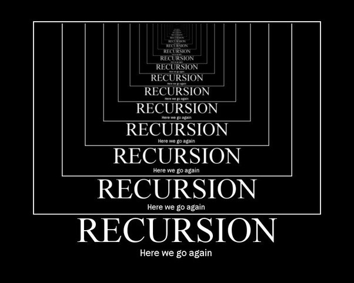

# Factorials & Recursion

## Factorials 

La factorielle d'un nombre entier n, notée n!, est le produit de tous les entiers positifs inférieurs ou égaux à n : n!=1×2×3×...×n. Les premières valeurs sont :

* 1! = 1
* 2! = 2
* 3! = 6
* 4! = 24
* 5! = 120
* 6! = 720

*Par convention, on pose 0! = 1.*

Par exemple la valeur factorielle de 5 est 120 :

* 1 x 2 x 3 x 4 x 5 = 120

Voici comment resoudre en Swift

```swift
func factorialOfValue(value: Int) -> Int {
if value == 0 {
	return 1
	} 
	var product: Int = 1 
	for i in 1...value {
		product = product * i
	}
	return product
}

factorialOfValue(value: 5)

```

## Recursion factorial

Une fonction récursive, c'est une fonction qui s'apelle elle même dans sa propre fonction (Recusive Call).

 

Count Down: 

La fonction countDown s'executera jusqu'à ce qu'elle remplisse la condition à savoir si la valeur est superieur à 1

```swift 
func countDown(value: Int) {
    print(value)
    if value > 1 {
        countDownToZero(value: value - 1)
    }
}

countDownToZero(value:4)
```
Dans ce cas, nous pourrions penser que cette fonction se realisera une celle fois, à savoir qu'elle pourrait retourner "1" ou "value * recursiveFactorialOfValiue(value: value - 1)".

Mais dans les faits, la fonction *recursiveFactorialOfValue* s'appel de nouveau avec pour valeur "value - 1".

```swift
func recursiveFactorialOfValue(value: Int) -> Int {
    
    if value == 0 {
        return 1
    }
    
    print(value)
    return value * recursiveFactorialOfValue(value: value - 1)
}

recursiveFactorialOfValue(value: 4)
```

Et la fonction s'execute, jusqu'à ce que la valeur soit égal à 0.

```swift
return 4 * recursiveFactorialOfValue(value: 3) // return 4 * 6 (= 24) 
	return 3 * recursiveFactorialOfValue(value: 2) // return 3 * 2 (= 6)
		return 2 * recursiveFactorialOfValue(value: 2) // return 2 * 1 (= 2)
			return 1 * recursiveFactorialOfValue(value: 0) //  return 1 (value == 0 -> 1)
			
/// recursiveFactorialOfValue(value: 4)

```

## Sources

* [Video Recursive Factorial Solution ](https://www.youtube.com/watch?v=gWoWZHonPdE) de la chaîne [Udacity](https://www.youtube.com/user/Udacity)

* [Swift Fun Algorithms #3: Factorials & Recursion](https://www.youtube.com/watch?v=EManXGSm_ak) de la chaîne [Lets Build That App](https://www.youtube.com/channel/UCuP2vJ6kRutQBfRmdcI92mA) 

* [Swift Recursion](https://www.programiz.com/swift-programming/recursion) du site internet [Programiz](https://www.programiz.com/)


